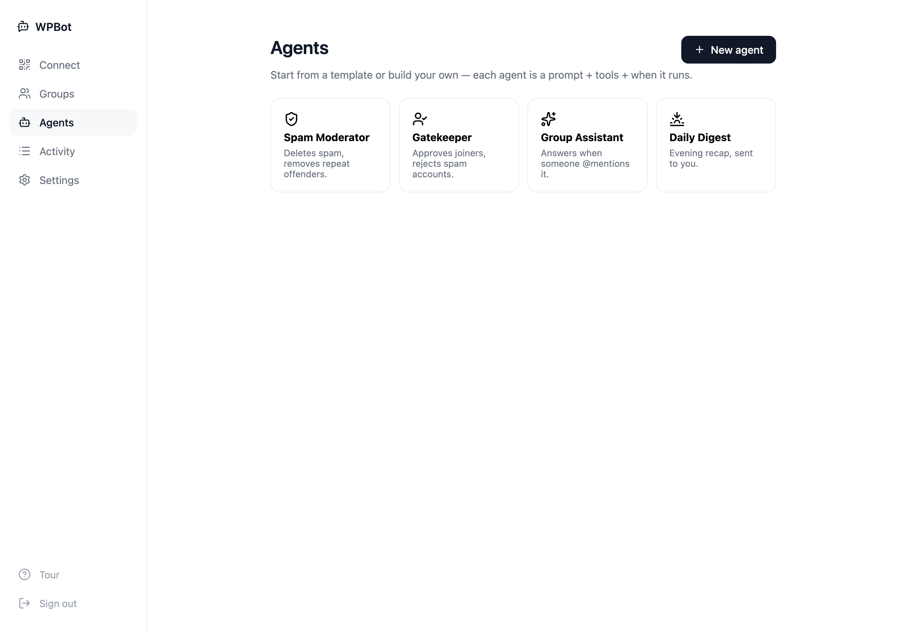
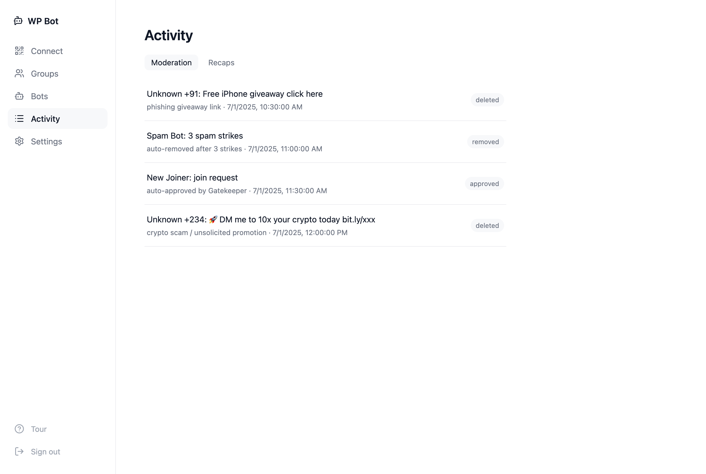
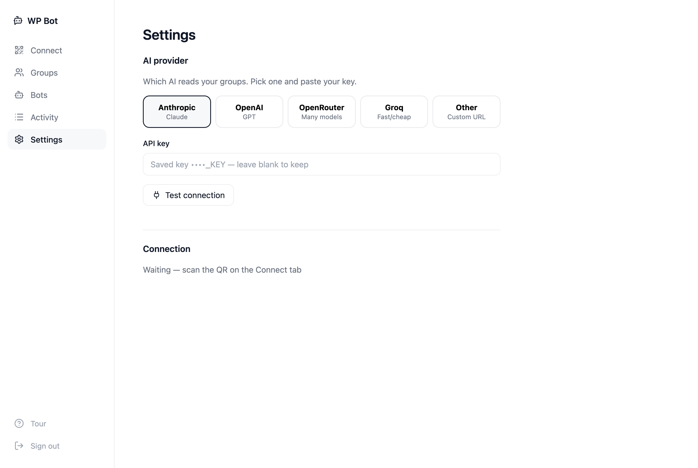

<h1 align="center">WPBot</h1>
<p align="center"><b>AI moderators for your WhatsApp groups</b></p>
<p align="center">Deletes spam and scams, screens who gets in, and recaps what mattered.</p>

<p align="center">
  <a href="https://flowengine.cloud/deploy/wpbot">
    
  </a>
</p>

---

WPBot puts simple AI **agents** in your WhatsApp groups. Each agent is a **prompt + the tools it may use + when it runs**, pointed at **all your groups or just one**:

- ✅ **Auto-clean spammers** — scams, phishing links and unsolicited ads gone in seconds
- ✅ **Screen new members** — auto-approve real joiners, reject bot accounts, remove repeat offenders
- ✅ **Daily digest** — one evening recap across all your groups
- ✅ **Any AI provider** — Anthropic, OpenAI, OpenRouter, Groq or a custom endpoint. Models are fetched live from the provider, never hardcoded.

Runs on **your own number** and **your own AI key**. No message data leaves your server.

---

## Set up in 4 steps

Scan a QR, pick your groups, choose what the bots do, connect your AI. That's it — no terminal, no bridge to babysit.

| 1. Connect | 2. Choose groups | 3. Add agents | 4. Connect AI |
|---|---|---|---|
|  |  |  |  |
| Scan the QR with your number | Toggle the groups to watch | Pick the moderators to run | Paste any key — models load in |

## Production-ready agents — you control the tools

Build agents to moderate your groups. Give each only the tools it needs; every action is logged.


**Available tools:** Send message · React · Send image · Create poll · Delete message · Remove member · Make admin · Lock group · Approve / reject joiners

Delete, remove, make-admin and lock need the linked number to be a group admin.



**Every action is logged** — the trust surface. You see exactly what was removed, approved, or kicked, and why.



**Bring any AI.** Anthropic, OpenAI, OpenRouter, Groq, or a custom endpoint. Paste your key, hit *Connect & load models*, done.



## Run locally

```bash
cp .env.example .env      # AI key optional — you can add providers in the UI
npm install
npm run dev               # → http://localhost:3000
```

Open the dashboard, create your account (first visit lets you pick a username + password), scan the QR. Done.

## Deploy on FlowEngine

WhatsApp needs an always-on connection — a laptop that sleeps won't cut it. [**Deploy on FlowEngine**](https://flowengine.cloud/deploy/wpbot) and it stays up 24/7, auto-restarts, and pairs to your phone by QR right in the app. Set your AI in Settings — any OpenAI-compatible key, or your FlowEngine gateway key.

<a href="https://flowengine.cloud/deploy/wpbot"></a>

## Good to know

- **Cheap by design.** Moderation only calls the AI when a message is actually risky (has a link, media, or is from a new member). Digests run once a day. See [src/bots/agent.js](src/bots/agent.js).
- **Uses a burner number.** WPBot rides WhatsApp Web (Baileys), which is against WhatsApp ToS. Use a dedicated number, never your personal line. Delete/remove/approve actions need that number to be a **group admin**.
- **Your data stays yours.** Messages live in a local SQLite file and auto-delete after `MESSAGE_TTL_HOURS` (default 48).

MIT licensed. Full build plan in [PLAN.md](PLAN.md).
