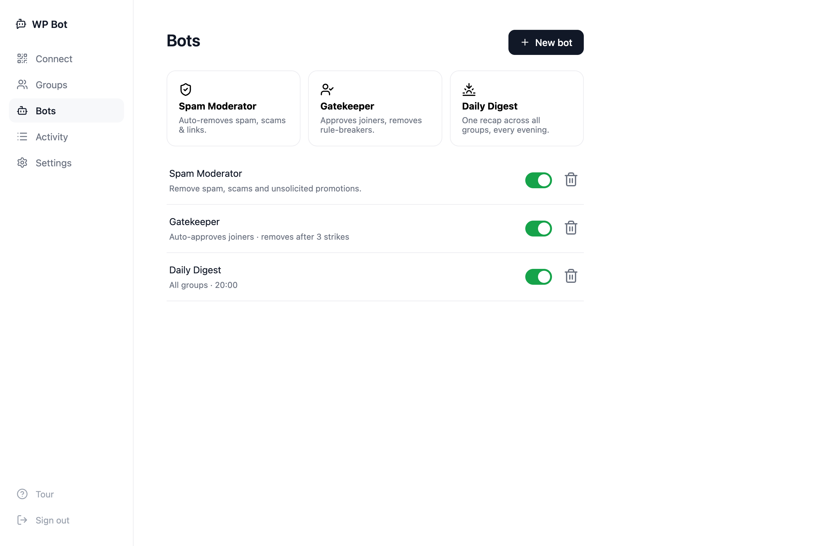

<h1 align="center">WPBot</h1>
<p align="center"><b>WhatsApp Groupchat Moderator</b></p>
<p align="center">Keeps your groups clean, and tells everyone what mattered.</p>

<p align="center">
  <a href="https://flowengine.cloud/deploy/wpbot">
    
  </a>
</p>

---

Moderate your WhatsApp groupchats with WPBot:

- ✅ **Auto-clean spammers** — scams, phishing links and unsolicited ads gone in seconds
- ✅ **Auto-approve & remove members** — approve joiners automatically, kick repeat rule-breakers
- ✅ **Add summarizing bots** — one evening recap across all your groups

Runs on **your own number** and **your own AI key**. No message data leaves your server.

---

## Set up in 4 taps

Scan a QR, pick your groups, choose what the bot does, connect your AI. That's it.

| 1. Link WhatsApp | 2. Choose rules | 3. Connect AI |
|---|---|---|
|  |  |  |

## What you get

**Three bots, one tap each.**



- **Spam Moderator** — reads new messages, deletes spam/scams/links automatically.
- **Gatekeeper** — auto-approves join requests, auto-removes members after repeated spam.
- **Daily Digest** — an evening summary across all your groups: decisions, action items, open questions, useful links.

**Every action is logged** — the trust surface. You see exactly what was removed, approved, or kicked, and why.


**Bring any AI.** Anthropic, OpenAI, OpenRouter, Groq, or a custom endpoint. Paste your key, hit *Test*, done.


## Run locally

```bash
cp .env.example .env      # set ADMIN_PASSWORD (AI key optional — you can add it in the UI)
npm install
npm run dev               # → http://localhost:3000
```

Open the dashboard, create your account, scan the QR. Done.

## Deploy on FlowEngine

WhatsApp needs an always-on connection — a laptop that sleeps won't cut it. [**Deploy on FlowEngine**](https://flowengine.cloud/deploy/wpbot) and it stays up 24/7, auto-restarts, and pairs to your phone by QR right in the app. Set your AI in Settings — any OpenAI-compatible key, or your FlowEngine gateway key.

<a href="https://flowengine.cloud/deploy/wpbot"></a>

## Good to know

- **Cheap by design.** Moderation only calls the AI when a message is actually risky (has a link, media, or is from a new member). Digests run once a day. See [src/bots/agent.js](src/bots/agent.js).
- **Uses a burner number.** WPBot rides WhatsApp Web (Baileys), which is against WhatsApp ToS. Use a dedicated number, never your personal line. Gatekeeper actions need that number to be a **group admin**.
- **Your data stays yours.** Messages live in a local SQLite file and auto-delete after `MESSAGE_TTL_HOURS` (default 48).

MIT licensed. Full build plan in [PLAN.md](PLAN.md).
