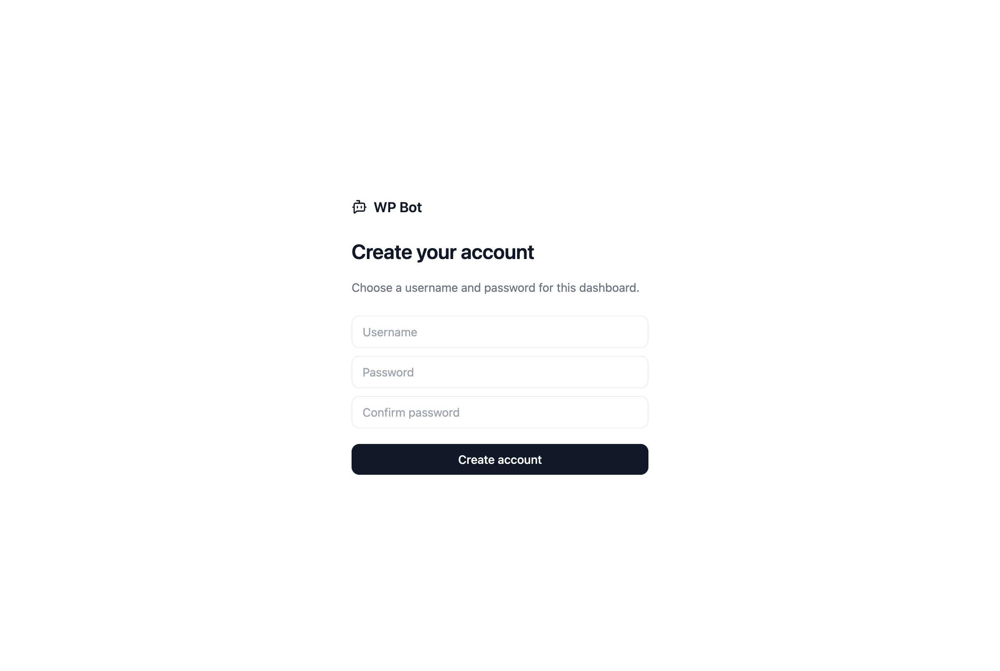

<h1 align="center">Deploy WPBot on FlowEngine</h1>

Your WhatsApp Groupchat Moderator, always on.

  

> Replace the button URL with your FlowEngine deploy link once the repo is connected.

---

## Why FlowEngine

WPBot holds a **live WhatsApp connection** — the moment it goes offline, moderation stops and messages are missed. A laptop or a serverless function can't keep that socket alive. FlowEngine can.

- 🟢 **Always on** — runs as a persistent app, not a request/response function. The WhatsApp socket stays connected 24/7.
- 🔁 **Auto-restart** — if the process crashes or the box reboots, FlowEngine brings it straight back and it reconnects.
- 🤖 **Built-in AI** — point `AI_BASE_URL` at FlowEngine's LiteLLM gateway and you **don't need your own AI key**. Billing and models are handled for you.
- 📜 **Logs & metrics** — see connection status, moderation actions, and errors from the FlowEngine dashboard.
- 🔒 **Your data stays put** — messages live in the app's own SQLite volume and auto-expire. Nothing is shipped to a third party.

## Before you start

- A **dedicated WhatsApp number** (a burner — never your personal line). For the Gatekeeper's approve/remove to work, this number must be a **group admin**.
- Your FlowEngine account.

## Deploy in 3 steps

**1. Create the app.**
In FlowEngine → **Hosting → New app → From Git**, point it at this repo. FlowEngine auto-detects Node and builds it (no Dockerfile needed).

**2. Set environment variables.**

| Variable | Value |
|---|---|
| `ADMIN_PASSWORD` | a password for your dashboard |
| `AI_BASE_URL` | your FlowEngine LiteLLM gateway URL (or leave blank and set the provider in the UI) |
| `AI_API_KEY` | your gateway/provider key |
| `PORT` | `3000` |
| `MESSAGE_TTL_HOURS` | `48` |

You can skip the AI vars and configure the provider from **Settings** in the app later.

**3. Deploy.**
Hit deploy. When it's live, open the app URL.

## Connect

1. Open your app URL and **create your account** (first visit lets you choose a username + password).

   

2. On **Connect**, scan the QR with your burner number: WhatsApp → **Linked devices** → **Link a device**.
3. Pick your groups, turn on **Spam Moderator**, **Gatekeeper**, and/or **Daily Digest**. Done.

## Keeping the session alive

FlowEngine keeps the container running, and WPBot auto-reconnects on drops. The WhatsApp login (device credentials) is stored in the app's `auth/` volume — **enable a persistent volume** for `auth/` and `data.db` so a redeploy doesn't force you to re-scan the QR.

## Scaling to many numbers

One app = one WhatsApp number. To run WPBot for many clients, deploy one app per number, or swap the transport ([src/transport/](../src/transport/)) for a WAHA/Evolution adapter that manages multiple sessions. Product logic doesn't change.
