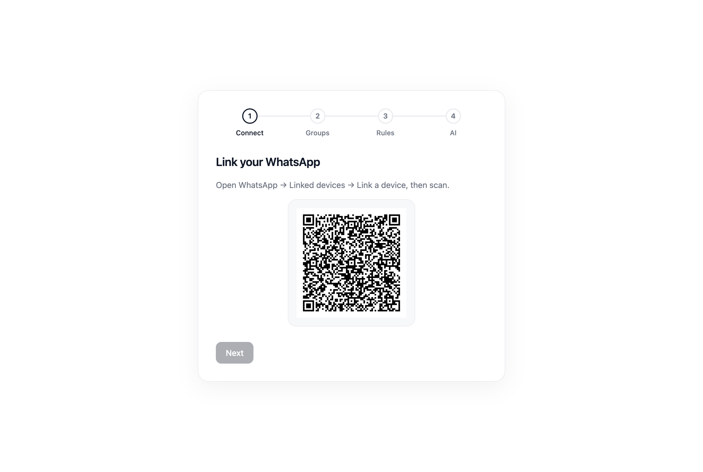
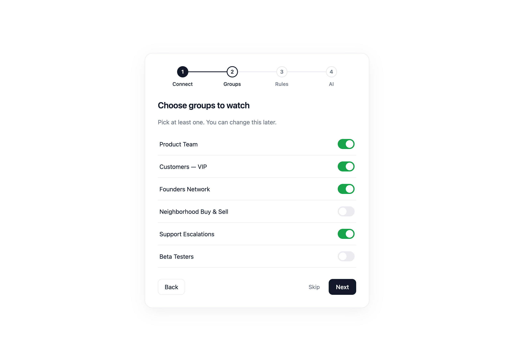
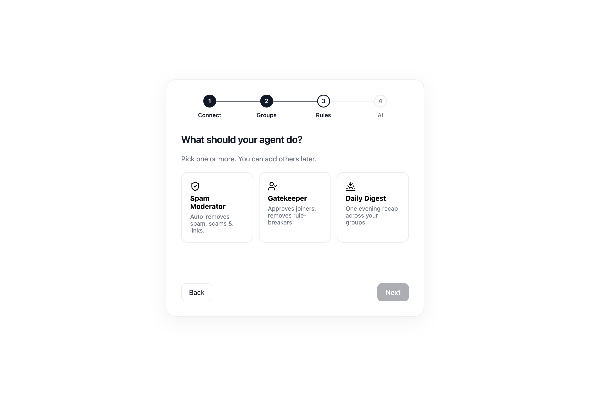
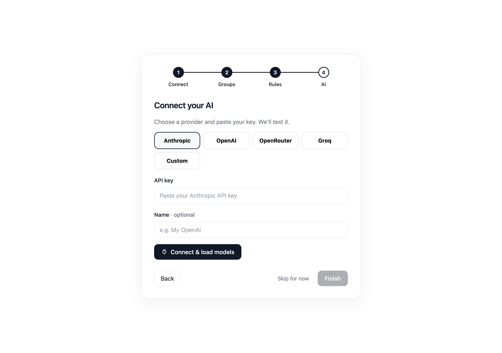
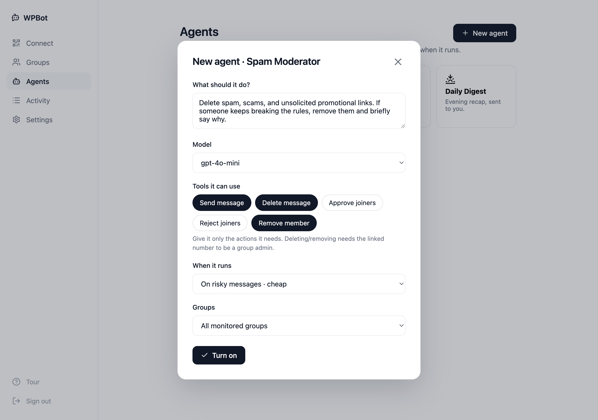

<h1 align="center">Deploy WPBot on FlowEngine</h1>

Your WhatsApp Groupchat Moderator, always on.

  

---

## Why FlowEngine

WPBot holds a **live WhatsApp connection** — the moment it goes offline, moderation stops and messages are missed. A laptop or a serverless function can't keep that socket alive. FlowEngine can.

- 🟢 **Always on** — runs as a persistent app, not a request/response function. The WhatsApp socket stays connected 24/7.
- 🔁 **Auto-restart** — if the process crashes or the box reboots, FlowEngine brings it straight back and it reconnects.
- 🤖 **Any AI provider** — set it in the app under **Settings**: paste an OpenAI-compatible key (or your FlowEngine gateway key). Models are fetched live from the provider, nothing is hardcoded.
- 📜 **Logs & metrics** — see connection status, moderation actions, and errors from the FlowEngine dashboard.
- 🔒 **Your data stays put** — messages live in the app's own SQLite volume and auto-expire. Nothing is shipped to a third party.

## Before you start

- A **dedicated WhatsApp number** (a burner — never your personal line). For the Gatekeeper's approve/remove to work, this number must be a **group admin**.
- Your FlowEngine account.

## Deploy in 2 steps

**1. Click Deploy on FlowEngine.**
The [deploy page](https://flowengine.cloud/deploy/wpbot) creates your instance from the pre-built `ghcr.io/flowengine-cloud/wpbot:latest` image (built automatically by GitHub Actions — no Docker Hub needed). All env vars below are optional.

**2. Deploy.**
Hit deploy. When it's live, open the app URL and create your account.

### Optional environment variables

| Variable | Value |
|---|---|
| `AI_BASE_URL` | OpenAI-compatible endpoint to preconfigure (or leave blank and add it in **Settings**) |
| `AI_API_KEY` | key for that endpoint |
| `PORT` | `3000` |
| `MESSAGE_TTL_HOURS` | `48` |

Skip them all and set your AI provider from **Settings** in the app after deploy.

## Connect

Open your app URL and **create your account** (first visit lets you choose a username + password), then the setup wizard walks you through four steps:

**1. Connect** — scan the QR with your burner number (WhatsApp → **Linked devices** → **Link a device**).

**2. Choose groups** — toggle on the groups WPBot should watch. It never touches a group you didn't switch on.

**3. Add agents** — pick Spam Moderator, Gatekeeper, and/or Daily Digest. Each is a template you can tweak.

**4. Connect AI** — choose a provider and paste a key; models are fetched live from the provider (nothing hardcoded). You can skip and set this in **Settings** later.

Every agent can run across **all monitored groups** or be scoped to **one group** — and you pick exactly which tools it may use (reply, delete, remove, approve/reject joiners):

## Keeping the session alive

FlowEngine keeps the container running, and WPBot auto-reconnects on drops. The WhatsApp login (device credentials) is stored in the app's `auth/` volume — **enable a persistent volume** for `auth/` and `data.db` so a redeploy doesn't force you to re-scan the QR.

## Scaling to many numbers

One app = one WhatsApp number. To run WPBot for many clients, deploy one app per number, or swap the transport ([src/transport/](../src/transport/)) for a WAHA/Evolution adapter that manages multiple sessions. Product logic doesn't change.
